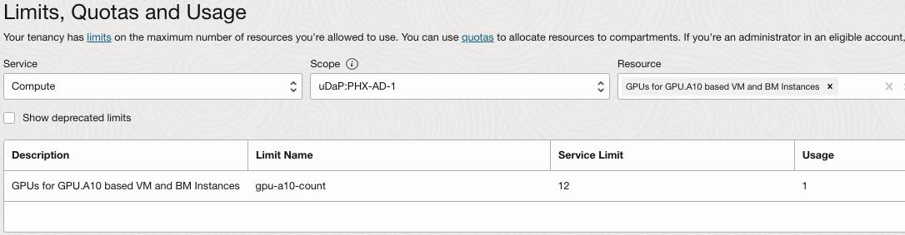
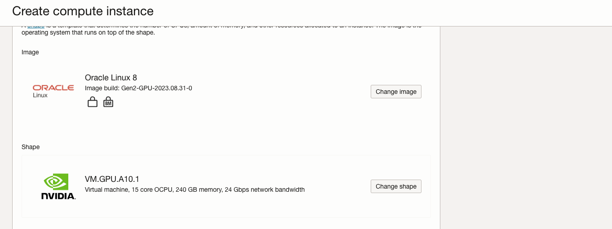
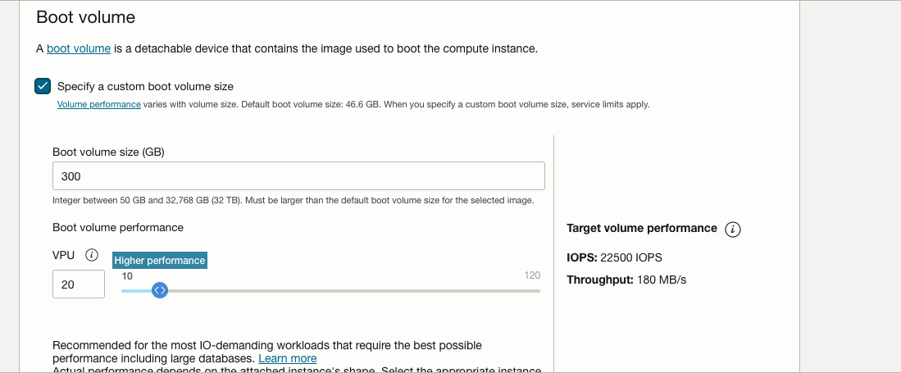
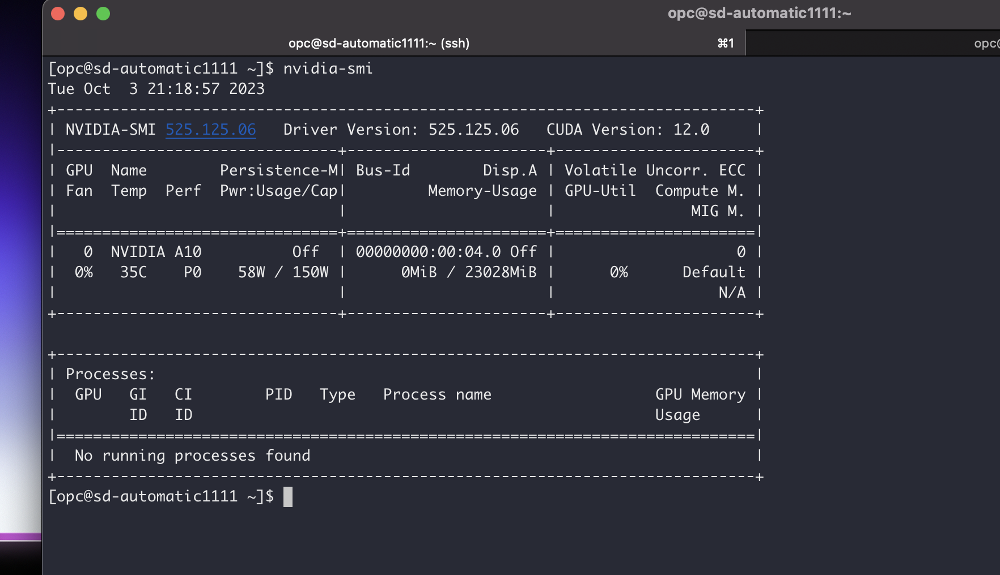
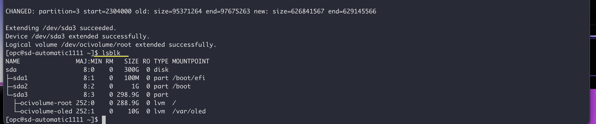
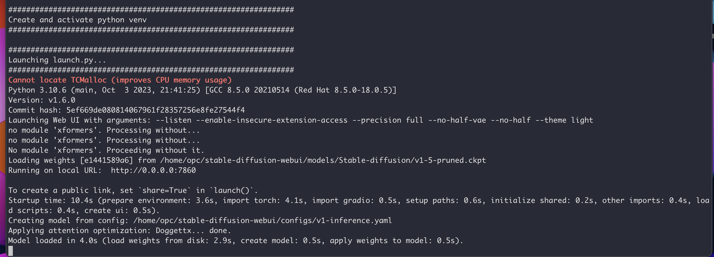
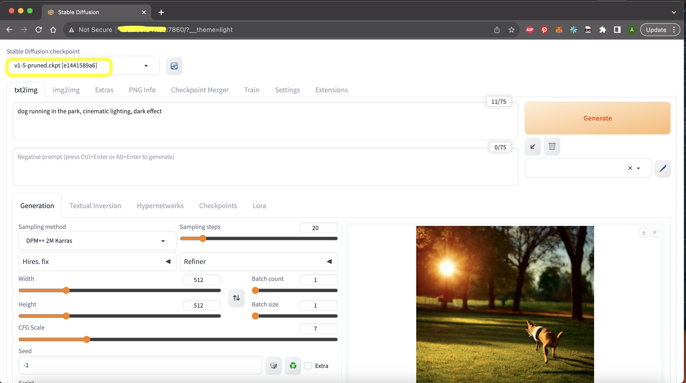

# Deploy Stable Diffusion Automatic1111 on Oracle Cloud Infrastructure GPUs 
In the ever-evolving landscape of artificial intelligence (AI) and machine learning (ML), researchers and engineers are constantly pushing the boundaries of what is possible. One remarkable development that has gained momentum in recent years is the Stable Diffusion model. This cutting-edge technology offers significant advantages, promises a wide array of use cases, and continues to see exciting developments. In this blog, we'll delve into the world of Stable Diffusion AI/ML models, exploring their benefits, exploring their use cases, and discussing the latest developments in this fascinating field.

## Introduction

**Stable Diffusion**: Stable Diffusion is a relatively new and innovative approach in the world of AI and ML. It's a probabilistic generative model that has gained prominence due to its ability to generate high-quality data samples and its robustness to various training conditions. The stable diffusion model, often based on the diffusion process, allows for controlled data generation and manipulation. Here's a brief overview of its key components:

**Diffusion Process**: The core idea of the stable diffusion model is the diffusion process, which models the evolution of a data distribution over time. It involves iteratively applying a noise process to the data until it converges to the desired distribution.

**Denoising Autoencoder**: Within the diffusion process, a denoising autoencoder is used to recover the original data from the noisy samples. This process helps the model learn and capture meaningful features of the data.

### Objective

Automatic1111 Stable Diffusion is a game-changing tool in the realm of AI-generated imagery. This innovative WebUI offers a user-friendly platform, reshaping the landscape of creating AI-generated images. With it, users can seamlessly operate and oversee their AI models dedicated to image generation. We will be deploying Automatic1111 and its pre-requisites to infer your favorite Stable Diffusion Model in Oracle Linux 8.

### Prerequisities
1. Oracle Cloud Infrastructure (OCI) tenancy with A10 GPU limits. 
2. An existing OCI Virtual Cloud Network (VCN) with atleast one public subnet and limits for public IP.
3. An Stable Diffusion Model checkpoint from your favorite Huggingface Creator. Limit the model to v1-5 and v2-1. Stable Diffusion XL is difficult to load on single A10 GPU. 


## Task 1: Provision an GPU compute instance on OCI

- Launch a compute instance on OCI with existing VCN with public subnet. For more information, see:

   - [Launch Compute Instance](https://docs.oracle.com/en/learn/oci-basics-tutorial/index.html#launch-compute-instance)

- Choose one from these available GPU.A10 shapes.

    ```
    VM.GPU.A10.1

    ```
- When launching a compute instance change shape to one of the above shapes. To launch GPU.A10 VM, click **Specialty and Previous Generation**, and select VM.GPU.A10.1 shapes.

- If your tenancy does not have a service limit set for GPU.A10, these shapes will not be in the shape list.

  - To check your tenancy limits in the OCI Console, set the region where you are going to provision a GPU.A10 compute instance, open the navigation menu and click **Governance & Administration**.

  - Under **Tenancy Management**, select **Limits, Quotas and Usage**.

  - Set the service to Compute, select one of availability domains in the scope field, and type *GPU.A10* in the resource field.

  - Select **GPUs for A10 based VM and BM instances**

    

- Compute limits are per availability domain. Check if the limit is set in any of availability domains of the region. If the service limit is set to 0 for all availability domains, you can click on the "request a service limit increase" link and submit a limit increase request for this resource.

    > **Note**: In order to access Limits, Quotas and Usage you must be a member of the tenancy Administrators group or your group must have a policy assigned to read LimitsAndUsageViewers.

    - For more information about service limits, see [Service Limits](https://docs.oracle.com/en-us/iaas/Content/General/Concepts/servicelimits.htm#ViewingYourServiceLimitsQuotasandUsage).

- Currently OCI GPU.A10 compute shapes support Oracle Linux, Ubuntu and Rocky Linux. Windows is supported by VM shapes only.

     >**Note**: Rocky Linux is not officially supported by NVIDIA.

- When provisioning a compute instance on OCI, use a standard OS image or GPU enabled Image. If you go with standard OS image, please know that requires NVIDIA vGPU driver to be installed.

  

- Expand Boot Volume section to increase the boot volume to atleast 250GB and increase VPU to Higher Performance to get a decent read/write for better inferencing. 
  
  

- Launch the instance with above parameters.  


## Task 2: Install Pre-requisites for Automatic1111

- As NVIDIA drivers are included in the Oracle Linux GPU build image, we can simply verify their presence and functionality by running the nvidia-smi command. This will ensure that everything is properly set up and the GPU drivers are functioning as expected.
  

- **Grow FileSystem** OCI instances system memory comes with 46.6GB default. Since we increased our Boot Volume to 300GB, let us grow our File System with in built OCI command from OCI Util.

To expand the file system on your OCI instance after increasing the boot volume to 300GB, you can use the built-in OCI (Oracle Cloud Infrastructure) command. Here's how you can do it:

   - **Check the current disk usage**: Before resizing the file system, it's a good practice to check the current disk usage to ensure it reflects the increased boot volume size. You can use the `df` command for this purpose:
   
   ```bash
   df -h
   ```

   Verify that the available space matches your new boot volume size (300GB).

   - **Resize the File System**: Use the OCI utility command to resize the file system to make use of the increased storage. The exact command can vary depending on the specific OS and file system you're using. The below is used for Oracle Linux 8
  
     ```
      sudo /usr/libexec/oci-growfs
     ```
    Enter 'y' when asked to confirm that you are extending partition.

   - **Verify the File System Expansion**: After running the resize command, check the disk usage again to confirm that the file system has been successfully expanded:

   ```bash
   df -h
   ```

   It should now reflect the increased file system size.

By following these steps, you should be able to expand your file system on your OCI instance to utilize the additional storage space provided by the increased boot volume. 

  


- **Install Python 3.10.6 in Oracle Linux 8**
    ```
    sudo dnf update -y
    sudo dnf install curl gcc openssl-devel bzip2-devel libffi-devel zlib-devel wget make -y
    wget https://www.python.org/ftp/python/3.10.6/Python-3.10.6.tar.xz
    tar -xf Python-3.10.6.tar.xz
    cd Python-3.10.6/
    ./configure --enable-optimizations
    make -j 2
    nproc
    sudo make altinstall
    python3.10 -V

    ```
- Now that we have Python3.10.6 installed let us install git to clone Git repos:

    ```
    sudo dnf install git
    ```

- **Clone Automatic1111**
  ```
  git clone https://github.com/AUTOMATIC1111/stable-diffusion-webui.git
  ```
  You should have the repo stable-diffusion-webui in your cloned directory

- Download your favorite Stable Diffusion Model to directory `stable-diffusion-webui/models/Stable-Diffusion`
    
    -For our usecase, here I have downloaded v1-5-pruned.ckpt from https://huggingface.co/runwayml/stable-diffusion-v1-5 
- **Update Firewall rules to allow port 7860 traffic**
  ```
  sudo firewall-cmd --list-all # To check existing added ports
  sudo firewall-cmd --zone=public --permanent --add-port 7860/tcp
  sudo firewall-cmd --reload
  sudo firewall-cmd --list-all # Confirm that port has been added.
  ```

## Task 3: Run AUTOMATIC1111

- With Python 3.10.6 successfully installed, the AUTOMATIC1111 software and the essential Stable Diffusion Models downloaded, we're ready to move forward with running AUTOMATIC1111. However, before proceeding, let's fine-tune our configuration to optimize the speed and overall quality of Stable Diffusion image generation.

- Please edit the `webui-user.sh` file and make the following adjustments. This script is responsible for configuring the arguments for AUTOMATIC1111 and is crucial for understanding and updating the available parameters.

    - Modify the parameter as follows: Add `listen` to run this as a server on port 7860, enable extension access for installing preferred Stable Diffusion extensions, and set precision to full.

    ```
    # Commandline arguments for webui.py, for example: export COMMANDLINE_ARGS="--medvram --opt-split-attention"
    export COMMANDLINE_ARGS="--listen --enable-insecure-extension-access --precision full --no-half-vae --no-half --theme light"
    ```
    
    - The below parameter to make sure Python3.10 is used. 
    ```# python3 executable
       python_cmd="python3.10"
    ```

    - The below parameter installs latest PyTorch2 instead of the default PyTorch. This has proven to be better in inferencing and image iteration speeds.
    ```
    # install command for torch
      export TORCH_COMMAND="pip install clean-fid numba numpy torch==2.0.1+cu118 torchvision --force-reinstall --extra-index-url https://download.pytorch.org/whl/cu118"
    ```

- After making sure there are no syntax errors, let us run the script webui.sh(not to be confused with webui-user.sh, the previously edited file)

  ```
  bash webui.sh
  ```
  The outcome of this process should include the installation of all the required packages for AUTOMATIC1111, including the latest PyTorch2. It will also load the essential models and launch the inference server on port 7860. If needed, you can customize the port by modifying the webui-user.sh file.
  

- After confirming a successful deployment with the server running on port 7860 as demonstrated above, let's proceed to access the Stable Diffusion application. Open your web browser and enter the following address: http://<PublicIP>:7860, replacing "<PublicIP>" with the instance's public IP address.

Once you do this, the application should load and appear as illustrated below. You'll find the desired models conveniently located in the top-right corner, as highlighted.

 
## Task 4: Deploy AUTOMATIC1111 via service manager systemctl

Create a file `stable-diffusion.service` in the path `/etc/systemd/system` 
And enter the below in the file `stable-diffusion.service`
```
[Unit]
Description=systemd service start stable-diffusion

[Service]
WorkingDirectory=/home/opc/stable-diffusion-webui
ExecStart=bash webui.sh
User=opc
[Install]
WantedBy=multi-user.target
```
Make sure to change your working directory to the necessary. 

Run the below commands to reload and enable/start the service.

```
sudo systemctl daemon-reload
sudo systemctl enable stable-diffusion.service
sudo systemctl start stable-diffusion.service
```
Run the below command to check the status of the service.

```
sudo systemctl start stable-diffusion.service
```

## Things to know and improvements
- Stable Diffusion Models come in a range of sizes and versions, including v1.1, v1.2, v1.3, v1.4, v1.5, v2.0, v2.1, and vSDXL. These versions are listed in ascending order of their capabilities and what they can accomplish. For instance, all the v1 models are capable of generating native 512x512 images. v2 can natively generate 768x768 images without requiring full precision. The file sizes for v1 models typically fall within the 6-8GB range per checkpoint model, while v2 models tend to have file sizes around 5.5GB per checkpoint model.

### Model Loading
- The multi-gigabyte model is loaded onto your GPU VRAM at the start of the execution, while the numerous CUDA cores meticulously process it hundreds of times per second. The data transfer rates involved are operating at the absolute limits defined by the laws of physics. Within the graphics card, factors such as the time required for an electrical signal to traverse the chip at the speed of light are not to be underestimated. 

- The GPU processes a set of calculations, then signals the CPU to provide more data for processing. Subsequently, it waits while the CPU accesses system memory to retrieve another batch of data and sends it to the GPU via PCI-E. Once the GPU has the data, it processes it and then signals the CPU again, entering another waiting phase.

- This is why VRAM plays a pivotal role in AI tasks. If you can preload all the necessary data and instructions onto the graphics card at the beginning of the operation, allowing it to process them at its blazing internal speeds, and simply collect the results at the conclusion, you can significantly reduce waiting times and minimize wasted resources. 

- In our use case, we utilize VM.GPU.A10.1, which boasts an NVIDIA A10 GPU with 24GB of RAM. A single NVIDIA A10 GPU is more than sufficient for smooth operation of v1.5. However, as the complexity of the prompt increases, generation time elongates, and iteration speed diminishes. There are pruned versions of v2 Stable Diffusion models that can execute operations more swiftly and smoothly than their original-sized v2 counterparts, primarily due to their reduced space requirements. Although all versions of Stable Diffusion models can be accommodated within a single NVIDIA A10 24 GB GPU, the pace of iteration and image generation time is contingent upon various factors, including the specific model, its size, prompt complexity, sampling steps, image dimensions, high-resolution adjustments, batch size, and more.

- In the forthcoming tutorial, we will explore how to partition the model, distribute it across multiple GPUs, and execute Stable Diffusion using multiple GPUs within a single machine. We will also explore fine-tuning an existing Stable Diffusion base model.


## Related Links

- [AUTOMATIC111 Github Repo Link](https://github.com/AUTOMATIC1111/stable-diffusion-webui)
- [Stable Diffusion Model v1-5](https://huggingface.co/runwayml/stable-diffusion-v1-5)
- [Python 3.10.6](https://www.python.org/ftp/python/3.10.6/Python-3.10.6.tar.xz)


## Acknowledgments

**Authors** - Abhiram Ampabathina (Senior Cloud Architect)
